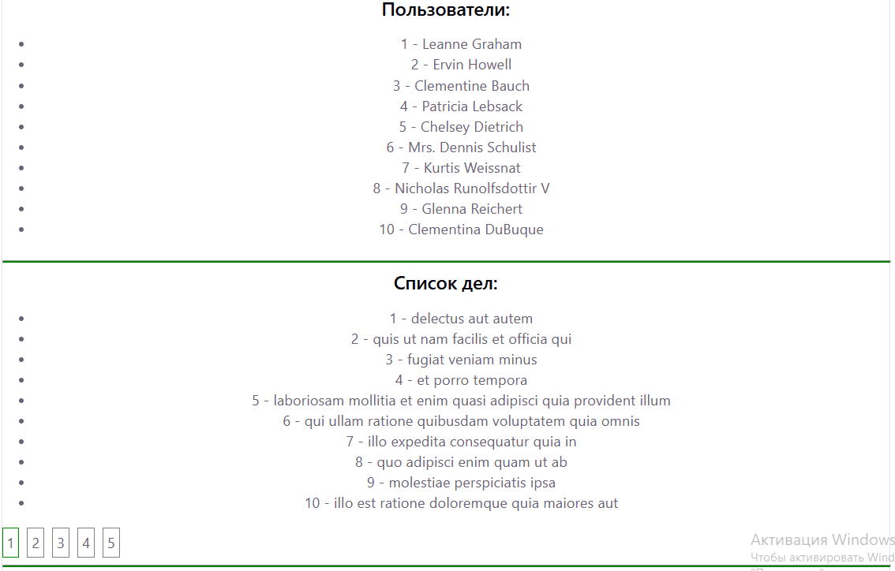
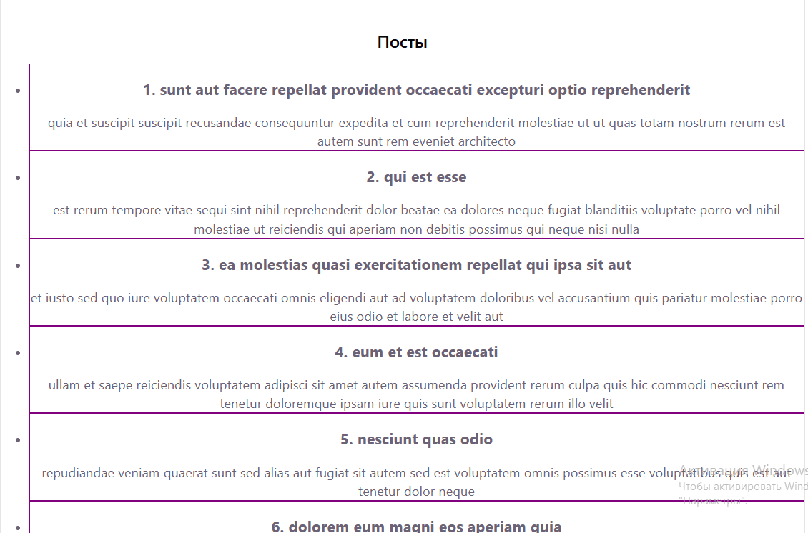
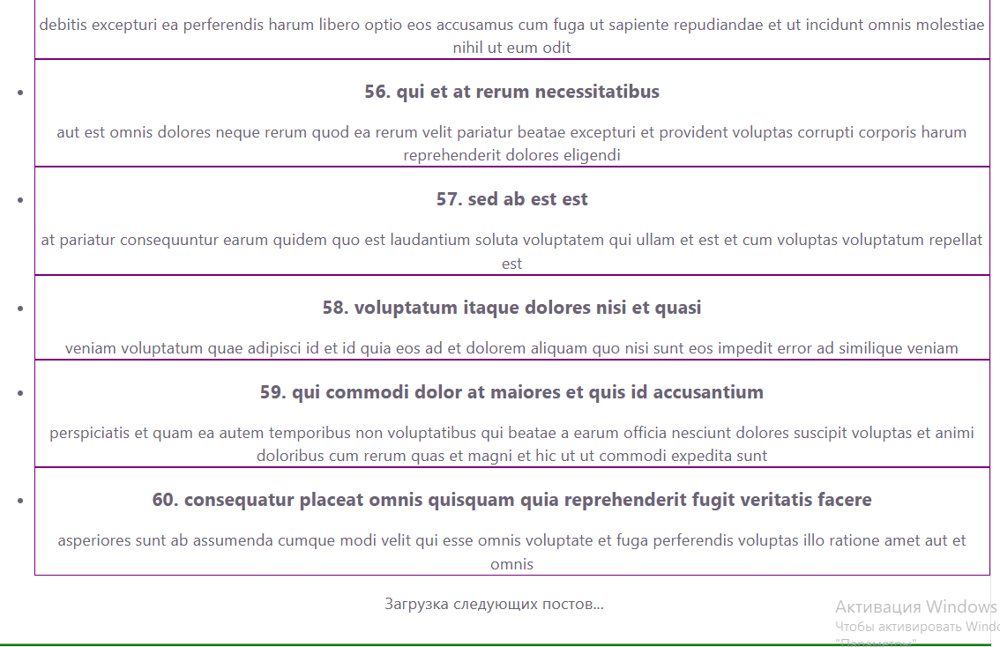
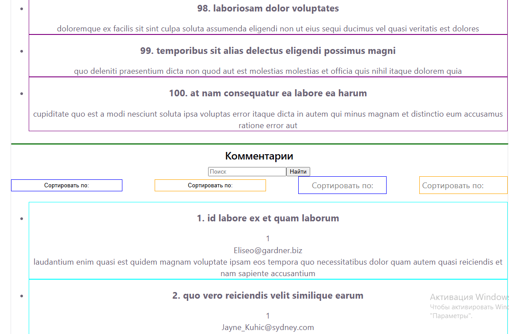
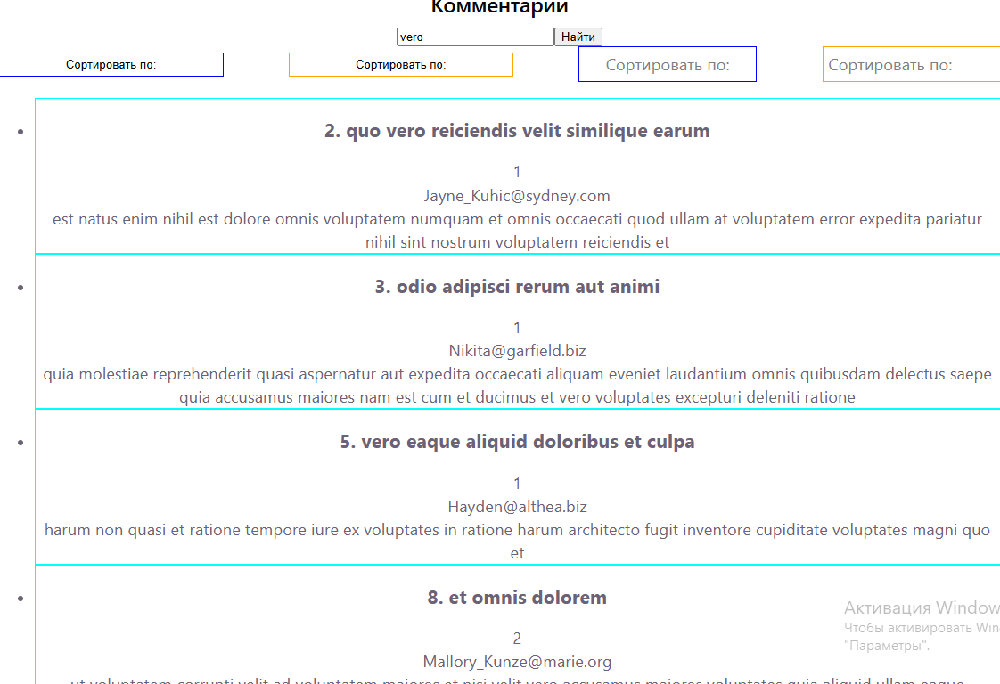
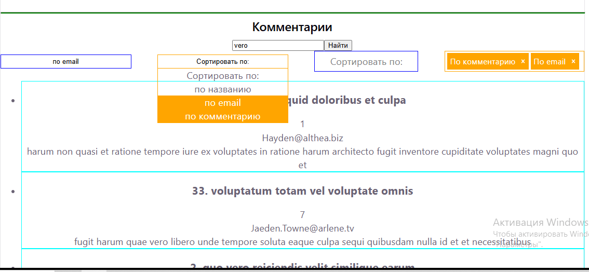
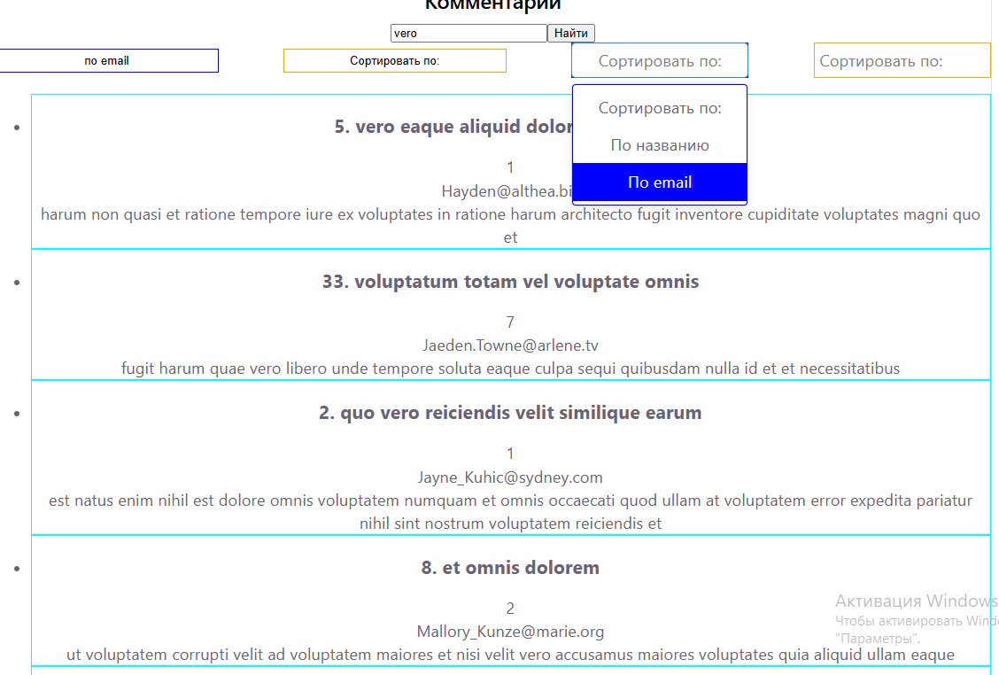
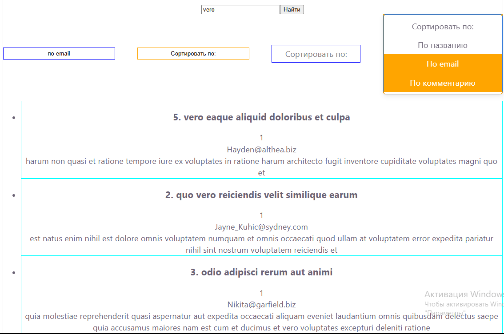
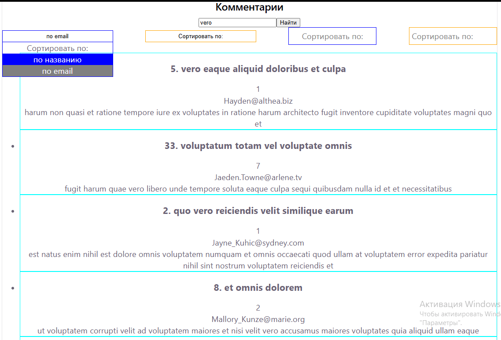

# 📦 RRT

**RRT (React + Redux + TypeScript)** — учебный проект для практического изучения Redux, работы с API, создания кастомных селектов и знакомства с библиотекой `react-select`.

---

## 🎯 Проект по STAR

| | |
|---|---|
| **Situation** | Требовалось на практике освоить связку React + Redux + TypeScript, научиться работать с API, сортировкой и фильтрацией данных. |
| **Task** | Изучить нативный Redux, создать собственный кастомный селект, интегрировать API, реализовать пагинацию, бесконечный скролл, фильтрацию и сортировку данных. |
| **Action** | Созданы редьюсеры и типизированные экшены; написаны кастомные хуки для типизированного `useSelector` и `useAction`; данные из API сохраняются в Redux; реализованы пагинация и бесконечный скролл (IntersectionObserver); разработаны кастомные селекты (одиночный и множественный выбор); изучена библиотека `react-select`; добавлены фильтрация (поиск по полю) и сортировка данных. |
| **Result** | Получено 4 списка с `jsonplaceholder`: простое отображение, пагинация, бесконечный скролл, а также фильтруемый и сортируемый список через кастомные селекты и `react-select`. |

---

## ✨ Ключевые особенности и решения

### 🔄 Работа с нативным Redux
- Создание редьюсеров и типизация экшенов
- Написание **thunk** для получения данных по API ([jsonplaceholder](https://jsonplaceholder.typicode.com))
- Кастомные хуки: типизированный `useSelector`, хук `useAction` со всеми thunk
- Управление состояниями загрузки (`loading`) и ошибки (`error`)

### 📄 Список с пагинацией
- Получение данных из API, сохранение в Redux и отображение с разбивкой на страницы

### ♾️ Бесконечный скролл
- Реализация подгрузки данных при скролле через `IntersectionObserver`

### 🎨 Кастомные селекты
- Разработаны собственные селекты с одиночным и множественным выбором
- Реализованы: открытие/закрытие выпадающего списка, стилизация выбранных пунктов

### 🔍 Фильтрация и сортировка
- Фильтрация списка через `input` + кнопка поиска
- Сортировка по выбранным опциям из селекта
- Комбинирование фильтрации и сортировки одновременно

### 📚 Библиотека `react-select`
- Ознакомление с библиотекой через создание селектов, визуально похожих на кастомные и выполняющих те же функции

---

## 🛠️ Технологический стек

| Категория | Технологии |
|-----------|------------|
| Фронтенд | React, TypeScript |
| Управление состоянием | Redux (нативный) |
| HTTP-запросы | Fetch / Axios (через thunk) |
| Стилизация | CSS / CSS Modules |
| UI-компоненты | Кастомные селекты, `react-select` |
| Наблюдение за скроллом | IntersectionObserver |

---

## 🚀 Локальный запуск проекта

```bash
git clone https://github.com/Alexey917/RRT.git
Запуск фронтенда
bash
npm install && npm run dev
После запуска приложение будет доступно по адресу: http://localhost:5173 (или другому порту, который покажет Vite).

## 📸 Скриншоты

| Обычный вывод списка | С пагинация |С бесконечным скроллом | С бесконечным скроллом
|:---:|:---:|:---:|
|  |  |  | 

| Кастомный селект | Кастомный селект | React Select | React Select | Фильтрация + сортировка |
|:---:|:---:|:---:|
|  |  |  |  |  |

📬 Контакты
Связаться со мной можно через:

<a href="https://vk.com/id321802975">  </a> <a href="https://t.me/Alexey917">  </a>
